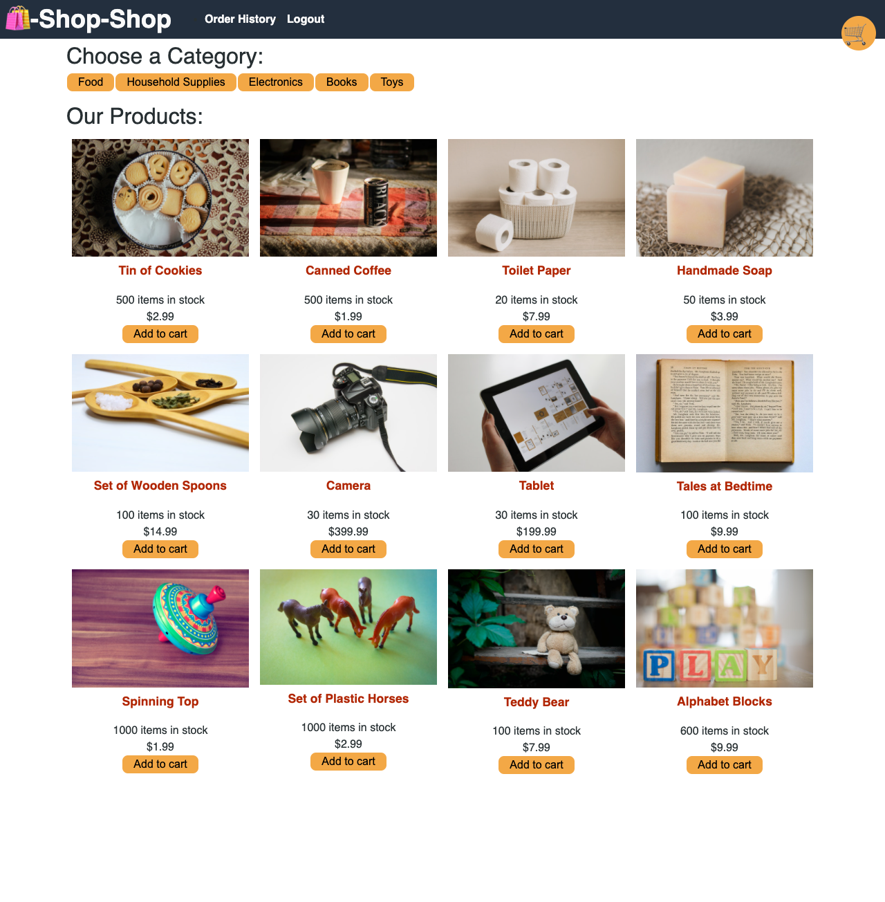

# Shop-Shop 
  
  ## Description 
  E-commerce platform initially made with Context API then refactored to use redux. User can create account, login, add items to cart view items, remove items from cart, checkout via stripe, and also view order history

  ## Table of Contents
  * [Installation](#installation)
  * [Usage](#usage)
  * [Credits](#credits)
  * [License](#license)
  
  ## Installation
  Run npm install at root folder

  ## Usage
  Visit the site live on heroku [https://rocky-citadel-48744.herokuapp.com/](https://rocky-citadel-48744.herokuapp.com/)

  ## Screenshot
  

  ## License
  This application is covered under the license Unlicense. For more info vist [http://unlicense.org/](http://unlicense.org/)

  ## Contributing
  No contributing guidelines

  ## Tests
  No testing instructions

  ## Questions
  My GitHub is [MichaelDevelopsCode](https://github.com/MichaelDevelopsCode) and for any questions you can reach me at michaeldevelopscode@gmail.com
